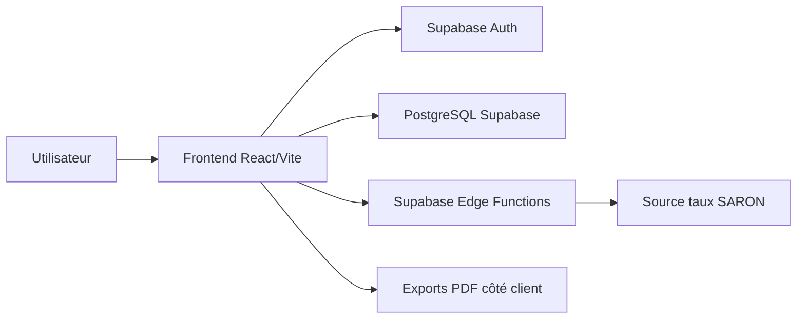

# Architecture Technique

## Vue d'ensemble

SIPA Analyzer est une application web React hébergée côté frontend et connectée à Supabase pour l'authentification, la base de données, les règles RLS et les Edge Functions.

## Composants

- `src/pages`: pages principales de l'application.
- `src/components`: composants réutilisables, dont admin, tableaux financiers, exports et supervision.
- `src/api/base44Client.js`: adaptateur d'accès aux tables Supabase.
- `src/utils`: calculs financiers, logs, exports PDF, SARON.
- `supabase/functions`: fonctions serverless.
- `supabase/migrations`: évolutions de schéma SQL.

## Données principales

- `properties`: biens immobiliers.
- `analysis`: analyses financières liées aux biens.
- `comments`: commentaires et traces d'audit métier.
- `favorites`: favoris utilisateur.
- `user_permissions`: rôles et permissions.
- `audit_logs`: logs de sécurité, connexion, exports et actions.

## Flux clés

1. L'utilisateur se connecte via Supabase Auth.
2. L'application récupère son rôle dans `user_permissions`.
3. Les routes et actions sont filtrées selon les permissions.
4. Les actions sensibles sont historisées dans `audit_logs` ou en commentaires d'audit.
5. Les suppressions de biens/analyses passent par une corbeille logique via `deleted_at`.

## Déploiement

Le frontend est buildé en fichiers statiques via Vite, puis déployé sur Vercel. Supabase héberge les données, l'authentification et les fonctions.

Voir [../DEPLOYMENT.md](../DEPLOYMENT.md).
